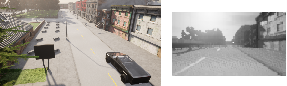

# Implementation of Self-supervised Deep Reinforcement Learning with Generalized Computation Graphs for Robot Navigation
Final project for CISC 856: Reinforcement learning 

-Simulation enviornment: Carla 0.9.13 (Town02 map)

  
    
   a) Simulation enviornment b) On-board camera

## Abstract
We implemented a self-supervised deep reinforcement learning algorithm on a simulated vehicle to learn a collision-free navigation policy. This algorithm is a generalized version of model-free and model-based learning that allows for more robust systems which use aspects of both learning methods. By using a list of generated actions and an image taken from a simulated on-board camera, the probability of collision for each time step is generated and used to navigate through an unstructured environment. After implementing and testing the algorithm under different conditions, the model had difficulties learning and produced sub-optimal results. Some improvements for future work on the system were identified which are planned to be pursued by all group members.

## Code List
### RL_project_main.py
Main file used to 
### gcg.py
Code to implement the generalized computation which uses a Recurrent Neural Network (RNN) for the task of collision avoidance over a short predictive horizon.

### RL_funcs.py

### config.py

### Carla_funcs.py

## Contributors
Riley Cooper - Electrical and Computer Engineering  
Jason Harris - Electrical and Computer Engineering  
Liam Horton - Mechanical and Materials Engineering  

